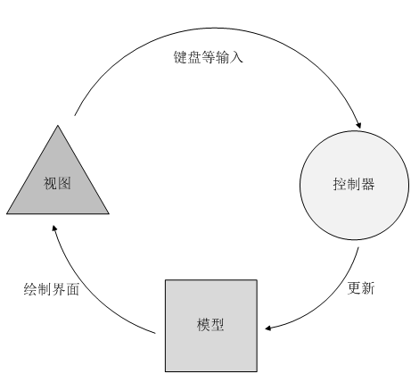
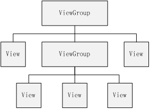

# 界面编程与视图组件
---
###设计手机用户界面应解决的问题
* 需要界面设计与程序逻辑完全分离，这样不仅有利于他们的并行开发，而且在后期修改界面时，也不用再次修改程序的逻辑代码
* 根据不同型号手机的屏幕解析度、尺寸和纵横比各不相同，自动调整界面上部分控件的位置和尺寸，避免因为屏幕信息的变化而出现显示错误
* 能够合理利用较小的屏幕显示空间，构造出符合人机交互规律的用户界面，避免出现凌乱、拥挤的用户界面

Android已经解决了前两个问题，使用XML文件描述用户界面；资源资源文件独立保存在资源文件夹中；对界用户面描述非常灵活，允许不明确定义界面元素的位置和尺寸，仅声明界面元素的相对位置和粗略尺寸。

###Android用户界面框架
* Android用户界面框架（Android UI Framework）采用MVC（Model-View-Controller）模型
* 提供了处理用户输入的控制器（Controller）
* 显示用户界面和图像的视图（View），以及保存数据和代码的模型（Model）

###Android用户界面框架
#####MVC模式：
 * *MVC模型中的控制器能够接受并响应程序的外部动作，如按键动作或触摸屏动作等*。
 * *控制器使用队列处理外部动作，每个外部动作作为一个对立的事件被加入队列中，然后Android用户界面框架按照“先进先出”的规则从队列中获取事件，并将这个事件分配给所对应的事件处理函数。*

* 在Android应用程序中，使用View和ViewGroup对象来创建用户界面。有很多类型的View和ViewGroup类，它们都是View类的后代。
* View对象是Android平台上用户界面的基础单元。View类用于叫做“widgets“子类的基类，它提供了UI对象完全实现，像文本域和按钮。ViewGroup用于叫做“layouts”子类的基类，它提供了不同类型的布局结构，像线性布局、表格布局、相对布局。
* 一个View对象就是一个数据结构，它的属性保存了屏幕的特定矩形区域的布局参数和内容。View对象会处理它自己的尺寸、布局、描画、焦点变更、滚动和跟驻留在屏幕特定矩形区域交互的键/手势等特性。作为用户界面中的一个对象，一个View也是给用户的一个交互点，并且接受交互的事件。
#####Android用户界面框架中的界面元素以一种树型结构组织在一起，称为视图树。
* 视图树由View和ViewGroup构成
* View是界面的最基本的可视单元，存储了屏幕上特定矩形区域内所显示内容的数据结构，并能够实现所占据区域的界面绘制、焦点变化、用户输入和界面事件处理等功能
* View也是一个重要的基类，所有在界面上的可见元素都是View的子类
* ViewGroup是一种能够承载含多个View的显示单元
* ViewGroup功能：一个是承载界面布局，另一个是承载具有原子特性的重构模块

#####Android系统会依据视图树的结构从上至下绘制每一个界面元素。每个元素负责对自身的绘制，如果元素包含子元素，该元素会通知其下所有子元素进行绘制

###UI界面控制
* 使用XML布局文件控制UI界面
 * Android推荐使用XML布局文件控制视图，可将视图控制逻辑从Java代码剥离，体现MVC原则。
 * Java代码通过setContentView(R.layout.<资源文件名>)在Activity显示视图；通过findViewById(R.id.[android.id属性值])访问指定UI组件
* 开发者也可以像开发Swing应用一样，完全抛弃XML文件，完全通过Java代码控制UI界面。实例：codes\02\2.1\CodeView
* 使用XML布局文件和Java代码混合控制UI界面
 * XML方式方便快捷，有失灵活；Java方式繁琐，不利于解耦
 * 可采用混合方式控制UI界面：变化小、行为比较固定的组件放在XML布局文件中管理，而变化大、行为控制比较复杂的组件通过Java控制。实例： codes\02\2.1\MixView

###开发自定义View
 当Android系统提供的UI组件不满足项目需要时，可通过继承View来派生自定义组件
 * 当Android系统提供的UI组件不满足项目需要时，可通过继承View来派生自定义组件
 * 然后重写View类的一个或多个方法
 * 可被重写的方法包括：构造器、onFinishInflate()、onMeasure()、onLayout()、onSizeChanged()、onDraw()、onKeyDown()、onKeyUp()、onTrackballEvent()、onTouchEvent()、onWindowFocusChanged()、onAttachedToWindow()、onDetachedFromWindow()、onWindowVisibilityChanged()
 * 实例：codes\02\2.1\CustomView

